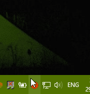

[](https://travis-ci.com/Merurino/pomodorino)

### Pomodorino (very simple task bar pomodoro)
I started developing this app to learn a bit about Electron. 

Pomodorino is the diminutive of pomodoro (so it would be equivalent to Cherry Tomato). My idea with this app is to make the simplest possible Pomorodoapp possible, so it has no interface besides the Tray icon and its context menu.

It is recommended to check the technique in more details on the [official website](https://cirillocompany.de/pages/pomodoro-technique)

How it works:



#### I want to add more or change the timers:
Just search on `main.js` for `{ id: '25', label: '25', type: 'normal', click: menuClick },`
This is the line that adds the 25 mins timer. You just add more or remove them. What is used as the time is the id field, so you an change the label for anything you need to.

#### Where I want this app to get to:
I intend to generate a proper release for it, as the installation process I managed to do here is not good enough yet. I still have to learn more about Electron to be able to achieve these goals.

This app was tested on Manjaro Linux XFCE, Windows 8.1 and Windows 10, hopefully it will work fine on Mac OS and other Linux distros as well.

I will try to play around with Travis CI in order to create releases for it.

### Some notes if you want to run the project locally:

I've had many issues while trying to test some changes while using Windows, had some issues with `speaker` module but the reason was I was using a non lts version of node, rolled back t a lts and it seems to work fine, but after the rollback had these issues:
Some errors in `node-gyp`, that were solved by following the Windows Option 1 on the steps given here (https://github.com/nodejs/node-gyp), and then I had to remove my `node_modules` folder, the `package-lock.json` and use `yarn` from there onwards (I was using npm beforehand)

Based on some reading, `node-gyp` should work fine in Linux. The gyp issue is more related to windows, so I may try to upgrade node again in Linux.

To run it in Visual Studio Code, this launch.json file should work:

```
{
    "version": "0.2.0",
    "configurations": [
        {
            "type": "node",
            "request": "launch",
            "name": "Launch Program",
            "program": "${workspaceFolder}\\main.js",
            "runtimeExecutable": "${workspaceRoot}/node_modules/.bin/electron.cmd",
            "runtimeArgs": [
                ".",
                "--enable-logging"
            ],
            "env": {},
        }
    ]
}
```

To test packaging locally: 

`yarn dist`

#### Credits:
- Tomato Icon: [Designed by Freepik](http://www.freepik.com/free-vector/delicious-ingredients-for-pizza_921351.htm)
- Audio: [From FreeSound.org](https://www.freesound.org/s/167337/)

#### Disclaimer:
Pomodoro Technique® and Pomodoro™ are registered and filed trademarks owned by Francesco Cirillo. Pomodorino is not affiliated by, associated with nor endorsed by Francesco Cirillo.